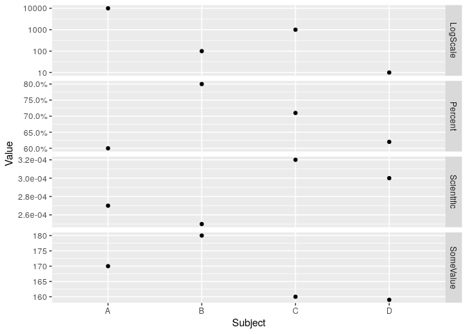

<!-- README.md is generated from README.Rmd. Please edit that file -->
facetscales
===========

The goal of facetscales is to let you use `facet_grid` with different scales per plot. This is useful for instance to display in different facets magnitudes with different units.

The final aim of this package is to get more experience on the right interface to provide this feature and ultimately merge it into ggplot2, if possible. Preserving compatibility with previous versions is not a high priority at this stage.

Discussion and pull requests are welcome.

Installation
------------

<!--
You can install the released version of facetscales from [CRAN](https://CRAN.R-project.org) with:

``` r
install.packages("facetscales")
```
-->
You can install the development version of facetscales with:

``` r
devtools::install_github("zeehio/facetscales")
```

The package is not on CRAN, as it is still under development.

Example
-------

This basic example shows the main feature of the package. Each `y` axis has its own scale:

``` r
library(ggplot2)
library(scales)
library(facetscales)
mydf <- data.frame(
  Subject = rep(c("A", "B", "C", "D"), each = 3),
  Magnitude = rep(c("SomeValue", "Percent", "Scientific"), times = 4),
  Value = c(c(170,0.6,2.7E-4),
            c(180, 0.8, 2.5E-4),
            c(160, 0.71, 3.2E-4),
            c(159, 0.62, 3E-4)))

scales_y <- list(
  Percent = scale_y_continuous(labels = percent_format()),
  SomeValue = scale_y_continuous(),
  Scientific = scale_y_continuous(labels = scientific_format())
)

ggplot(mydf) +
  geom_point(aes(x = Subject, y = Value)) +
  facet_grid_sc(rows = vars(Magnitude), scales = list(y = scales_y))
```


